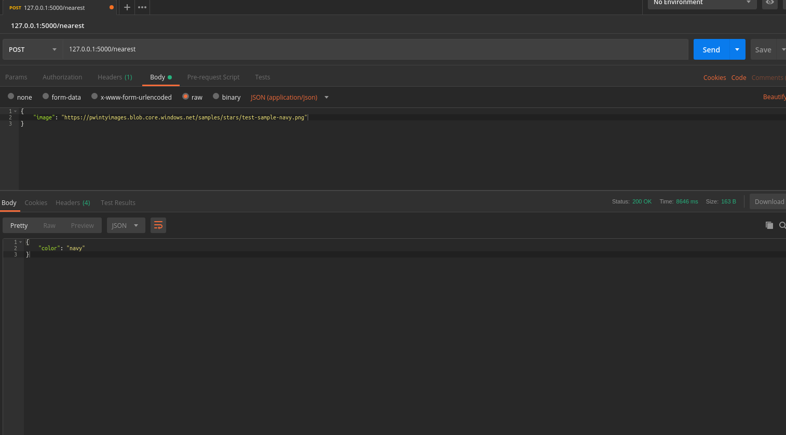

# Nearest Color

[](https://travis-ci.org/samuele-mattiuzzo/nearest-color)

## Requirements
- Python 3
- Pip
- Flask

## Local setup

- create a virtual environment

  ```
  $ python3 -m venv env
  $ source env/bin/activate
  ```

- install the dependencies

  ```
  $ pip3 install -r requirements_dev.txt
  ```

## Running the app

- to run the app locally, run

  ```
  $ export FLASK_APP=app.py && flask run
  ```


- to run the tests, run

  ```
  $ py.test
  ```


## Screenshots





### Explanation and considerations

Please visit [this link](https://gist.github.com/samuele-mattiuzzo/b63a6a71609f293b97fab143d40c07a1) for a detailed explanation on how this was built and some considerations
